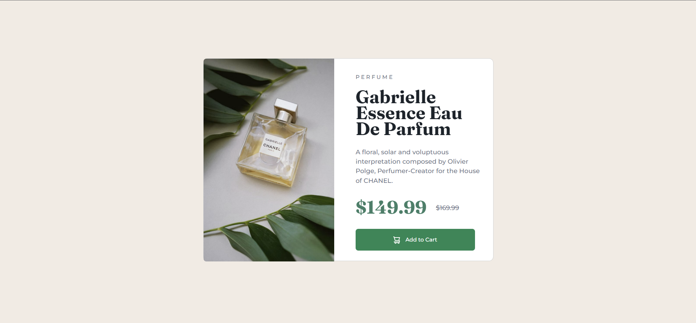

# Frontend Mentor - Product preview card component solution

This is a solution to the [Product preview card component challenge on Frontend Mentor](https://www.frontendmentor.io/challenges/product-preview-card-component-GO7UmttRfa). Frontend Mentor challenges help you improve your coding skills by building realistic projects.

## Table of contents

- [Overview](#overview)
  - [The challenge](#the-challenge)
  - [Screenshot](#screenshot)
  - [Links](#links)
- [My process](#my-process)
  - [Built with](#built-with)
  - [What I learned](#what-i-learned)
  - [Continued development](#continued-development)
  - [Useful resources](#useful-resources)

**Note: Delete this note and update the table of contents based on what sections you keep.**

## Overview

### The challenge

Users should be able to:

- View the optimal layout depending on their device's screen size
- See hover and focus states for interactive elements

### Screenshot

#### desktop

#### mobile

### Links

- Solution URL: [Add solution URL here](https://github.com/Hakxep-wuqpuk-hyrze8/product-preview-card-component-challenge)
- Live Site URL: [Add live site URL here]()

## My process

### Built with

- HTML
- CSS custom properties
- Bootstrap card component

### What I learned

Practice using bootstrap, and making responsive website

### Continued development

maintenance and update the code, and make website look more prettier

### Useful resources

- [Example resource 1](https://getbootstrap.com/docs/5.2/components/buttons/#disabled-state) - button component from bootstrap.
- [Example resource 2](https://getbootstrap.com/docs/5.2/components/card/) - card component from bootstrap.
